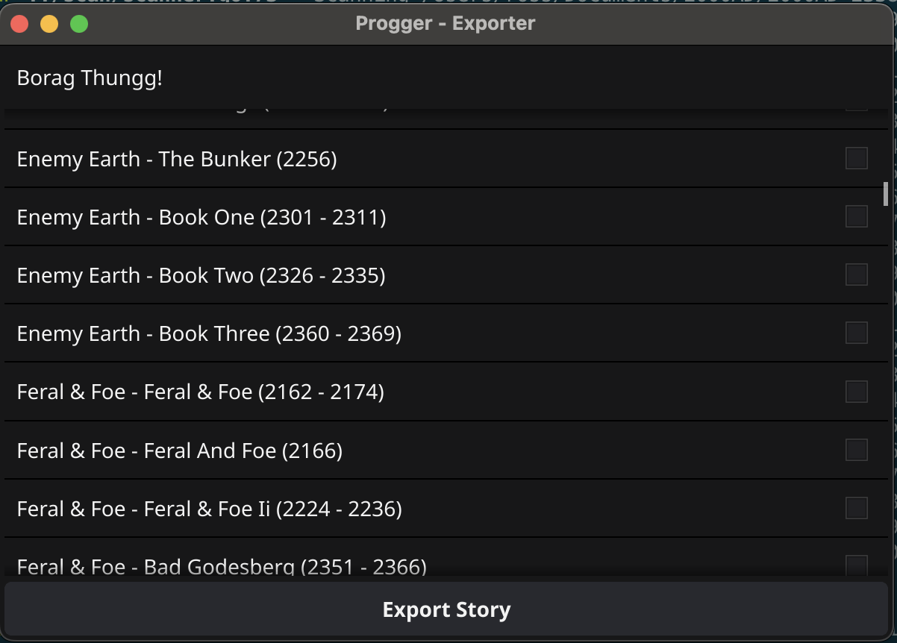

<p align="center">
  <a href="https://goreportcard.com/report/chooban/progger/exporter"></a>
</p>

# Exporter

A GUI application for creating your own PDFs for a series. 

## Install

There's not an install process at the moment, you'll need to compile it yourself for now. 

This requires:
* Working go installation
* Install [pdfium](https://jpadilla.com/2022/09/02/installing-pdfium-in-mac-os/)
* Installing [fyne.io](https://docs.fyne.io/started/)

Once you've done all that, clone the report and try:


```sh
cd export
go run cmd/exporter.go
```

If all goes well, you should see something like this:


